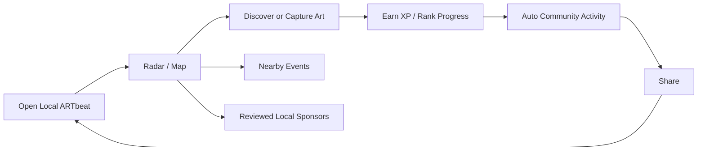
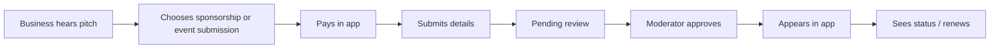

# Local ARTbeat Revenue and Retention Plan

Last updated: 2026-06-28

## Current Product Shape

Local ARTbeat is now focused on the loop people already like:

1. capture public/local art
2. discover nearby art through map/radar
3. complete art walks
4. earn XP, ranks, and achievements
5. generate community activity automatically
6. share local discoveries

Revenue should attach to that loop without changing what users came for. The app should not become a general marketplace, social network, commission board, or admin tool again.

## Business Goal

Make Local ARTbeat profitable by selling simple, review-gated local visibility products to businesses, venues, event organizers, and community partners in the areas where the app is actively capturing art.

The strongest sales message is:

> Local ARTbeat helps people discover the public art, events, and local businesses around them while they are already out exploring.

## Non-Negotiables

- Keep the app named Local ARTbeat.
- Preserve the current visual identity and core app experience.
- Keep admin/moderation out of the mobile app.
- Do not bring back old artist marketplace, commissions, storefronts, auctions, boosts, random posting, bot posting, or AI feed content.
- Paid placements must require review before display.
- Community feed should remain activity-driven, not open-ended posting.
- Revenue products must be understandable to a small-town business owner in under 30 seconds.

## Revenue Products

| Product | Buyer | Placement | Starting price |
| --- | --- | --- | --- |
| Discovery Sponsorship | Local businesses near public art | Radar/discovery | $49 / 30 days |
| Capture Sponsorship | Businesses supporting local art activity | Capture detail/local art surfaces | $99 / 30 days |
| Art Walk Sponsorship | Tourism boards, venues, galleries, downtown groups | Art walk surfaces | $249 / 30 days |
| Event Submission | Artists, venues, community groups, towns | Events list/detail after approval | $25 / event |
| Event Tickets | Event attendees | Event detail ticket flow | Optional later |

### Discovery Sponsorship

Current code fit: `SponsorshipTier.discover`

This should be the first paid product because radar is one of the strongest loved features. The promise is simple: appear as a reviewed local sponsor when users discover art nearby.

### Capture Sponsorship

Current code fit: `SponsorshipTier.capture`

This monetizes the capture/share behavior without charging users to capture.

### Art Walk Sponsorship

Current code fit: `SponsorshipTier.artWalk`

This is the premium tier because art walks are closer to an outing or destination experience.

### Event Submission

This is a reviewed listing/submission product, not a ticketing fee. Approved events appear in Local ARTbeat. If an event sells real-world tickets, ticket payments can remain separate.

### Event Tickets

Current code fit: `TicketPurchaseSheet` and `UnifiedPaymentService.processEventTicketPayment`

Keep ticketing optional for now. Ticketing creates payout, refund, support, tax, and organizer-operation complexity. Event listing is simpler and better for the first monetization release.

## Payment Strategy

| Product | Recommended processor | Reason |
| --- | --- | --- |
| Discovery Sponsorship | IAP if sold inside the app | It buys in-app visibility. |
| Capture Sponsorship | IAP if sold inside the app | It buys in-app visibility. |
| Art Walk Sponsorship | IAP if sold inside the app | It buys in-app visibility. |
| Event Submission | IAP if sold inside the app | It buys in-app listing/review. |
| Real-world event tickets | Stripe | Tickets are for a real-world event/service and may require organizer payout. |

### Resolved Mobile Direction

The mobile sponsorship checkout path is IAP-based. `SponsorshipCheckoutService` starts the configured store product, waits for the matching purchase event, and saves IAP product/purchase/transaction metadata on the pending sponsorship.

Recommended decision:

- use IAP for self-serve sponsorship/listing products purchased inside the app
- use Stripe for real-world ticketing or future web/admin purchases outside the app
- keep Stripe for real-world ticketing or future web/admin purchases outside the app

## Purchase And Review Flow

The buyer should experience this like ordering a simple local placement:

1. choose product
2. choose area or related art walk/event if required
3. enter business/event details
4. upload logo or image
5. acknowledge review requirement
6. pay
7. submission enters `pending`
8. moderator approves or rejects outside the mobile app
9. approved item becomes active
10. buyer can see status in app

Required copy:

- "Submitted for review"
- "Payment received"
- "Your sponsorship will not appear until approved"
- "If rejected, we will cancel or refund according to policy"

## Moderator Dashboard Scope

Build this outside the mobile app, preferably as a private WordPress admin section/plugin connected to Firebase/Stripe/App Store metadata as needed.

First dashboard version:

- pending sponsorships
- pending event submissions
- approve/reject
- view creative/business details
- status history
- simple notes
- expire/remove item

Do not build:

- full CRM
- complex ad manager
- artist marketplace administration
- commission workflow
- multi-role enterprise system

## Retention Plan

Retention should come from the fun local loop, not from adding heavy features.

Daily and weekly reasons to return:

- new art nearby
- new event nearby
- rank movement
- XP progress
- recent activity from captures, discoveries, and art walks
- one nearby discovery prompt
- art walk completion prompt

Keep:

- XP for captures
- XP for discoveries
- XP for completing art walks
- XP for likes on feed activity
- rankings/leaderboards
- achievements/badges
- radar/discovery

Simplify:

The old quest/goal/challenge system should not drive the first revenue release. If retained in code, expose it only as simple user-facing prompts:

- "Today nearby"
- "Weekly local rank"
- "Keep your streak"

## User Loop

## Business Loop

## Launch Offer

For the first towns/cities, use founder-friendly pricing:

- Discovery Sponsorship: $49 / month
- Capture Sponsorship: $99 / month
- Art Walk Sponsorship: $249 / month
- Event Submission: $25 each

Sales script:

> I am documenting and promoting local public art in this area through Local ARTbeat. People can capture, map, discover, and share local art. Local businesses can sponsor nearby discoveries or submit art/community events for review.

## What To Build Next

### Phase 1: Make Revenue Products Coherent

- Confirm final payment routing for sponsorships and event submissions.
- Rename any remaining "ad" language to "sponsorship" unless it is a literal technical ad placement.
- Make the sponsorship purchase flow status-driven: draft, paid, pending review, approved, active, rejected, expired.
- Add event submission fee support.
- Add clear review language before payment.

### Phase 2: Moderator Dashboard

- Private WordPress plugin scaffold exists at `wordpress/local-artbeat-moderator/`.
- Start with sponsorship/event approval only.
- Keep mobile app free of admin controls.
- Next live step: install the plugin on the WordPress site, configure a restricted Firebase service account, and test approve/reject against development Firestore records.

### Phase 3: Retention Loop

- Make radar/discover a first-class home action.
- Surface XP/rank progress after capture/discovery/art walk.
- Add nearby activity prompts.
- Keep feed activity auto-generated.

### Phase 4: Sales Readiness

- Add a simple website page explaining sponsorships and event submissions.
- Add "Sponsor local discovery" and "Submit an event" calls to action.
- Prepare one-page town/business pitch.

## Success Metrics

Track weekly:

- captures created
- discoveries completed
- art walks started/completed
- community activity generated
- shares
- event submissions
- sponsorship submissions
- sponsorship approvals
- active paid placements
- repeat sponsors

Do not optimize for:

- raw account signups alone
- random posting volume
- feature count
- marketplace inventory

## Recommendation

Proceed with a focused monetization release:

1. sponsorships as the core business product
2. paid event submissions as the low-friction product
3. optional real-world ticketing later
4. rankings/radar/XP as retention
5. WordPress/backend dashboard for moderation
